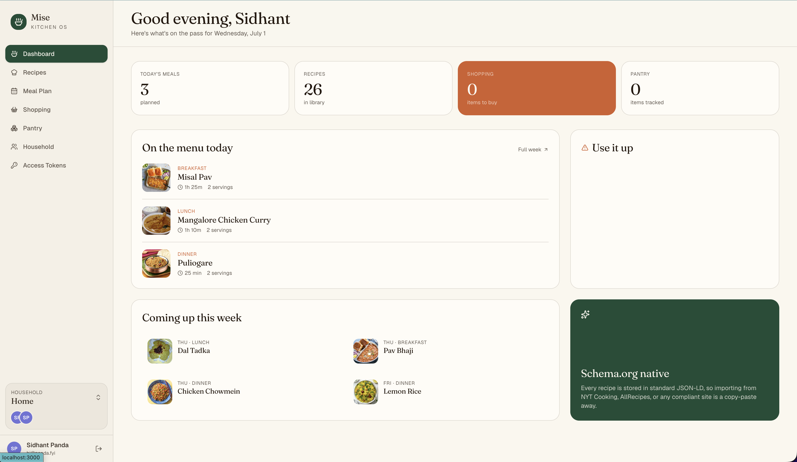
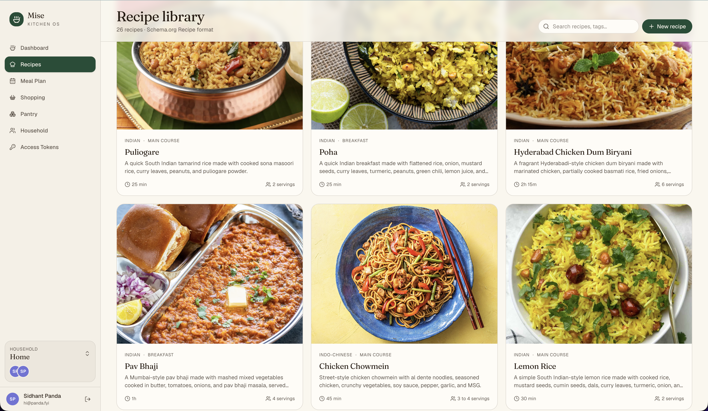
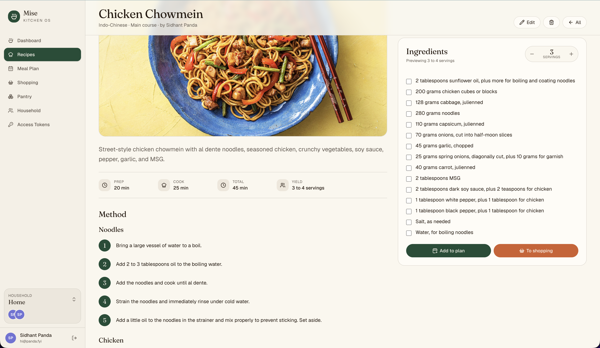
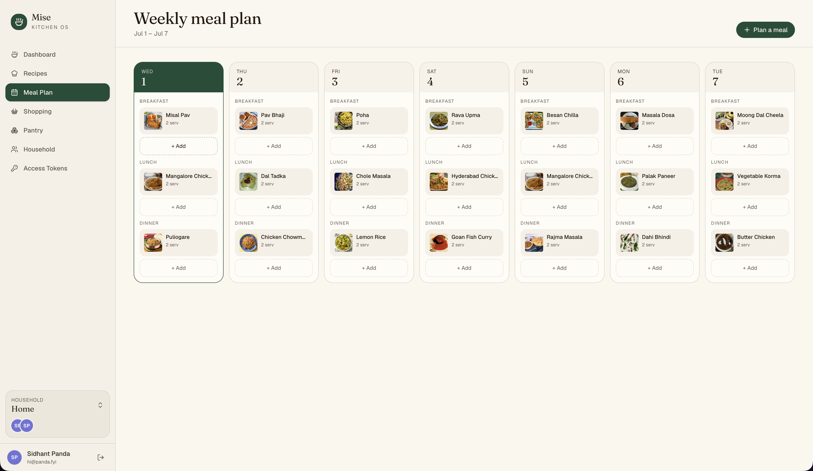

# Mise — Kitchen Companion Hub


Mise is a Schema.org‑native kitchen OS for households and restaurants: recipes, meal
plans, pantry, and a shopping list in one place. Recipes are stored in standard
[Schema.org Recipe](https://schema.org/Recipe) JSON‑LD, so data is portable to and from
any compliant tool.

See the [Roadmap](ROADMAP.md) for what's planned next.

## Screenshots

### Dashboard



### Recipes



### Recipe Details



### Meal plan



## Run with docker compose

1. Copy [compose.yml](compose.yml)
2. Copy [.env.example](.env.example) to `.env`
3. Run `docker compose up -d`

## Prerequisites

- **Node.js** 20+ (developed on 24) — for local development
- **pnpm** 9+ (developed on 11 — `corepack enable` will provide it)
- **Docker** (for the database in dev, and to build/run the app in production)

## First‑time setup (development)

```bash
# 1. Create your local env file (dev defaults work out of the box)
cp .env.example .env

# 2. Start PostgreSQL (+ Adminer) for local dev, in the background
docker compose -f compose.dev.yml up -d

# 3. Install dependencies (also generates the Prisma client)
pnpm install
```

In development the app **creates the database and tables on startup** if they don't
exist, so you never have to run migrations manually. Pick **one** of the two options
below for the database.

**Option A — start empty (tables only, no data):**

```bash
# Create all required tables without any demo data.
pnpm db:push

# ...or skip this entirely — the tables are created automatically the first
# time you start the app (e.g. via `pnpm dev`).
```

You'll start with a clean slate; create your first account from the app's signup
screen (name / email / password), then the onboarding flow lets you create your
household or restaurant.

**Option B — seed demo data (recommended for a first look):**

```bash
# A sample household with recipes, meal plan, pantry, and shopping list.
pnpm db:seed
```

After seeding you can sign in with:

> **Email:** `demo@mise.app`  **Password:** `password`

> **Note:** `pnpm db:seed` is destructive for the demo account — it wipes and
> recreates the demo household each run. It does not touch other accounts you've
> created. Choose Option A if you want a truly empty database.

## Development

Run the dev database in one terminal and both apps in another:

```bash
pnpm dev:db          # terminal 1 — Postgres + Adminer (or omit if already running)
pnpm dev             # terminal 2 — API front door (:3000) + web SSR (:4000)
```

Then open **http://localhost:3000**.

`pnpm dev` runs both apps with hot reload via `concurrently`: the API server on `3000`
proxies the Vite dev server on `4000`, so the whole app (including HMR) is available on
`3000`. You can also run them individually:

```bash
pnpm --filter server dev
pnpm --filter web dev
```

### Environment variables

All config lives in the root `.env`, which is read by **both** Compose and the apps (via
dotenv). The defaults target the local dev database.

| Variable | Purpose |
|----------|---------|
| `POSTGRES_USER` / `POSTGRES_PASSWORD` / `POSTGRES_DB` / `POSTGRES_PORT` | Postgres container + credentials (`POSTGRES_PORT` is the single source of truth for the port) |
| `ADMINER_PORT` | Port for the Adminer database UI (default `8080`) |
| `APP_PORT` | Host port the bundled app is published on in production Compose (default `3000`) |
| `DATABASE_URL` | Prisma connection string (host‑side dev; in Compose the app builds its own from `POSTGRES_*`) |
| `JWT_SECRET` | Signing secret for auth cookies (**change in production**) |
| `SERVER_PORT` | API port — set to `3000` by the run scripts (the front door) |
| `WEB_URL` | Where the API proxies the frontend (default `http://localhost:4000`) |
| `WEB_ORIGIN` | Browser‑facing origin, used for CORS |
| `AUTO_MIGRATE` | Set to `false` to skip the boot‑time schema sync (the production image does this) |
| `VITE_API_URL` | Optional — the web app calls the API same‑origin by default; set only to target a different origin |

### Common commands

| Command | What it does |
|---------|--------------|
| `pnpm dev` | Run API + web together with hot reload |
| `pnpm dev:db` | Start the dev Postgres + Adminer |
| `pnpm build` | Production build of both apps |
| `pnpm start` | Run the built apps locally (API `:3000` + web `:4000`) |
| `pnpm lint` | Lint all packages |
| `pnpm format` | Prettier‑format the repo |
| `pnpm db:create` | Create the database if it's missing (for fresh containers) |
| `pnpm db:push` | Push the Prisma schema to the database |
| `pnpm db:seed` | Seed demo data |
| `pnpm db:studio` | Open Prisma Studio to browse the database |

Package‑specific scripts (e.g. `pnpm --filter web typecheck`,
`pnpm --filter server typecheck`) are also available.

### Database

The schema is defined in `apps/server/prisma/schema.prisma`. After changing it, push the
changes and regenerate the client:

```bash
pnpm db:push
```

Postgres data is bind-mounted to `./data/postgres` (gitignored). To reset the dev
database completely (wipes all data):

```bash
docker compose -f compose.dev.yml down
rm -rf ./data/postgres
pnpm dev:db
```

### Browsing the database (Adminer)

`pnpm dev:db` also starts [Adminer](https://www.adminer.org/), a lightweight database UI,
at **http://localhost:8080**. Log in with:

| Field | Value |
|-------|-------|
| System | PostgreSQL |
| Server | `postgres` (pre-filled) |
| Username | `kitchen` (`POSTGRES_USER`) |
| Password | `kitchen` (`POSTGRES_PASSWORD`) |
| Database | `kitchen` (`POSTGRES_DB`) |

(`pnpm db:studio` is also available if you prefer Prisma Studio.)

## Production deployment

The whole app ships as a single Docker image (API + SSR frontend served on one port),
built by the multi-stage `Dockerfile`. `compose.yml` runs it together with Postgres, a
one-shot schema-migration step, and Adminer.

### How the stack is wired

- **`app`** — the bundled image. The API is the front door on port `3000` (serves `/api`
  and proxies the built-in SSR frontend). Published on `${APP_PORT}` (default `3000`).
- **`migrate`** — a one-shot service that runs `prisma db push` to sync the schema, then
  exits. The app image ships **without** the Prisma CLI, so migrations run here; the app
  waits for this to finish before starting.
- **`postgres`** — the database (data persisted in `./data/postgres`).
- **`adminer`** — optional database UI on `${ADMINER_PORT}` (default `8080`).

### First-time start

```bash
# 1. Create and edit the env file: set a strong JWT_SECRET, a real POSTGRES_PASSWORD,
#    and WEB_ORIGIN to your public URL.
cp .env.example .env

# 2. Build the image and start everything (Postgres → migrate → app).
docker compose up -d --build
```

The `migrate` step creates the tables, then the app starts. Visit
**http://localhost:3000** (or your `APP_PORT`).

### Reload the app after a `git pull`

```bash
git pull
docker compose up -d --build
```

This rebuilds the image, re-runs `migrate` (applying any schema changes), and recreates
the `app` container. Unchanged services (Postgres, Adminer) keep running. To restart the
app **without** rebuilding (e.g. only an env change):

```bash
docker compose up -d app          # or: docker compose restart app
```

### Run only the database migration

```bash
# Rebuild the migrate image first if the schema changed, then apply it.
docker compose build migrate
docker compose run --rm migrate
```

`prisma db push` is idempotent, so this is safe to run repeatedly.

### Other operations

| Command | What it does |
|---------|--------------|
| `docker compose logs -f app` | Tail the app logs (API + web) |
| `docker compose ps` | Show service status / health |
| `docker compose restart app` | Restart the app without rebuilding |
| `docker compose down` | Stop the stack (Postgres data persists in `./data/postgres`) |
| `docker compose down && rm -rf ./data/postgres && docker compose up -d --build` | Full reset — **wipes the database** |

### Production notes

- The runtime image sets `AUTO_MIGRATE=false`, so the app never migrates on boot —
  schema changes are applied only by the `migrate` step. If you run the image **outside**
  Compose (`docker run …`), apply the schema yourself first (run the `migrate` service or
  a `prisma db push` from an image that has the CLI).
- Set `JWT_SECRET` and the database credentials to real secrets — the `.env` defaults are
  for local dev only.
- Auth cookies are marked `Secure` in production, so serve the app over **HTTPS** (e.g.
  behind a TLS-terminating reverse proxy) or the browser will drop the login cookie.
- `docker compose` also builds a `kitchen-companion-hub:build` image used **only** by the
  one-shot `migrate` service; the deployed runtime image is the smaller
  `kitchen-companion-hub:latest`.

## Tech notes

- **Single port / proxy:** the API server is the entry point in both dev and prod. It
  serves `/api` and proxies everything else to the web server — in dev that's the Vite
  dev server (with HMR); in prod it's the SSR server serving the pre-built app. No proxy
  config is needed in Vite.
- **SSR + auth:** protected pages render a loading state during SSR and fetch on the
  client after hydration, so no session cookie is forwarded through the SSR server.
  `/login` and `/signup` are public and fully server‑rendered.
- **Prisma 7** uses driver adapters; the connection URL lives in
  `apps/server/prisma.config.ts` (which loads the shared root `.env`), not in
  `schema.prisma`.
- Recipes, pantry items, and meals are exchanged in their Schema.org shapes end‑to‑end,
  so the API responses map directly onto the frontend types.

## License

Licensed under the [Elastic License 2.0](LICENSE.txt) (ELv2). In short: you're free
to use, copy, modify, and self‑host this software — including inside a business —
provided you keep the copyright/license notices intact. You may **not** provide it to
third parties as a hosted or managed service. This is a source‑available license, not
an OSI‑approved open‑source license.
